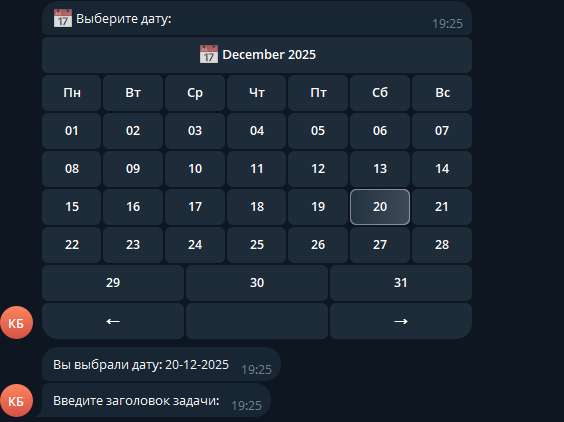
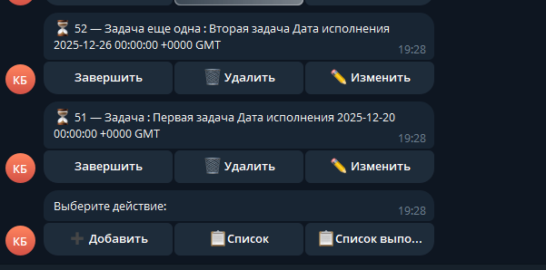

TODO Bot

Менеджер задач на Go с интеграцией в Telegram и хранением данных в PostgreSQL.

🚀 Возможности:

-Добавление задач с датой, заголовком и описанием

-Просмотр списка активных и завершённых задач

-Редактирование и удаление задач

-Отметка задач как выполненных

-Уведомления о приближающихся сроках

🛠️ Технологии

-Go

-PostgreSQL + sqlx

-Telegram Bot API (go-telegram-bot-api/v5)

-zerolog для логирования

-godotenv + envconfig для конфигурации

📂 Структура проекта

-adapter/driven — работа с БД и моделями

-adapter/driving — Telegram‑бот и маршрутизация

-services — бизнес‑логика

-config — загрузка конфигурации

-pkg/logger — логирование

📝 Пример использования

В Telegram:

-Нажми ➕ Добавить, чтобы создать задачу

-Выбери дату через календарь

-Введи заголовок и описание

-Управляй задачами через inline‑кнопки

📸 Скриншоты

📌 Roadmap
Добавить веб‑интерфейс
Расширить возможности редактирования и добавления задач